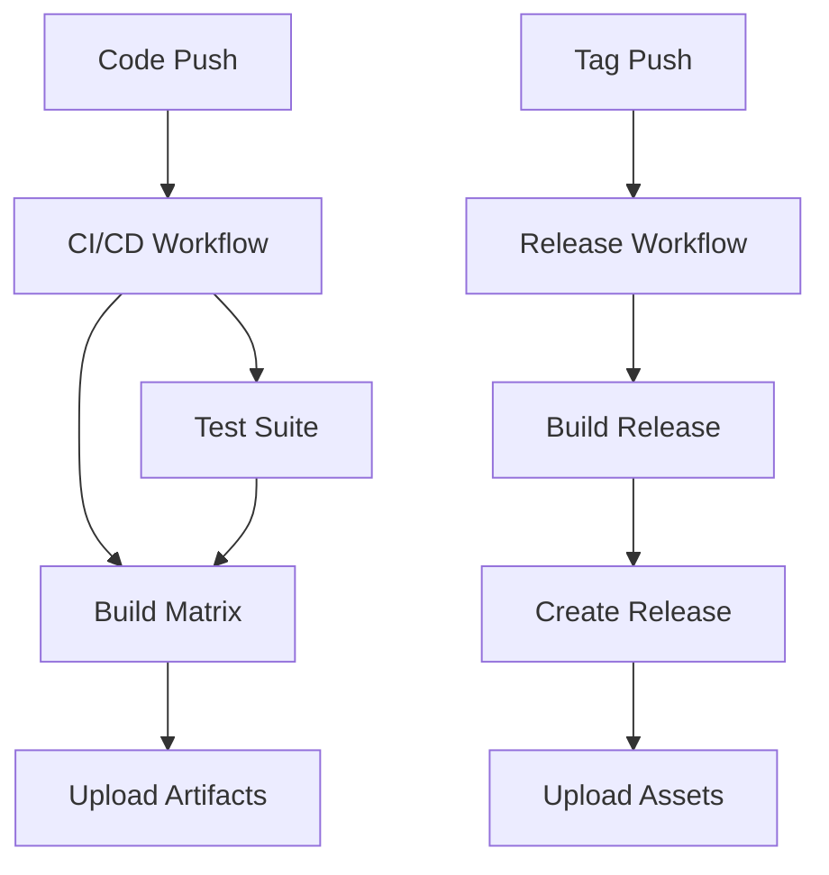

# 🐱 GitHub Workflows Documentation

This directory contains GitHub Actions workflows for the Hakinet Network Tools Suite.

## 📋 Workflows Overview

### 1. `release.yml` - Release Workflow 🚀
**Triggers:**
- Push tags matching `v*` (e.g., `v1.0.0`, `v0.1.0`)

**Features:**
- Builds cross-platform binaries (Linux x86_64, Windows x86_64)
- Creates installation packages with helpful scripts
- Upload assets to the GitHub release

**Usage:**
```bash
# Create and push a tag to trigger a release
git tag v1.0.0
git push origin v1.0.0
```

### 2. `ci-cd.yml` - Continuous Integration 🔄
**Triggers:**
- Push to `main` or `develop` branches
- Pull requests to `main` branch

**Features:**
- Runs comprehensive tests and linting
- Builds for both Linux and Windows platforms
- Uploads build artifacts for testing
- Ensures code quality with formatting and clippy checks

### 3. `build-linux.yml` - Linux Build Pipeline 🐧
**Triggers:**
- Push to `main` or `develop` branches
- Pull requests to `main` branch
- Manual workflow dispatch

**Features:**
- Installs libpcap development libraries
- Builds optimized Linux binaries
- Strips debug symbols for smaller size
- Enables formatting checks and linting
- Uploads build artifacts

### 4. `build-windows.yml` - Windows Build Pipeline 🪟
**Triggers:**
- Push to `main` or `develop` branches
- Pull requests to `main` branch
- Manual workflow dispatch

**Features:**
- Downloads and configures WinPcap development pack
- Builds Windows binaries with MSVC
- Enables formatting checks and linting
- Uploads build artifacts

## 🚀 Usage Guide

### Creating a Release

1. **Tag your commit:**
   ```bash
   git tag v1.0.0
   git push origin v1.0.0
   ```

2. **The release workflow will automatically:**
   - Create a GitHub release with cute cat descriptions
   - Build binaries for Linux and Windows
   - Attach the binaries to the release
   - Generate release notes

### Manual Workflow Triggers

You can also trigger workflows manually from the GitHub Actions tab:

1. Go to your repository on GitHub
2. Click on "Actions" tab
3. Select the workflow you want to run
4. Click "Run workflow"

### Manual Testing

You can manually trigger builds using GitHub's web interface:

1. Go to the **Actions** tab in your repository
2. Select the workflow you want to run
3. Click **Run workflow**
4. Choose the branch and click **Run workflow**

### Monitoring Workflow Status

- 🟢 **Green checkmark**: Workflow passed successfully
- 🔴 **Red X**: Workflow failed, check logs for details
- 🟡 **Yellow circle**: Workflow is currently running
- ⚪ **Gray circle**: Workflow was canceled

## Artifacts

### Linux Builds
- **File:** `hakinet-linux-x86_64.tar.gz`
- **Contains:**
  - `hakinet` (packet capture tool)
  - `hakinet-scan` (network scanner)
  - `README.md`
  - `install.sh` (installation script)

### Windows Builds
- **File:** `hakinet-windows-x86_64.zip`
- **Contains:**
  - `hakinet.exe`
  - `hakinet-scan.exe`
  - `README.md`
  - `INSTALL.txt` (installation instructions)

## Dependencies

### Linux
- `libpcap-dev` - Packet capture library
- `pkg-config` - Package configuration tool

### Windows
- WinPcap Development Pack - Downloaded automatically during build

## Environment Variables

The workflows set the following environment variables:

### Windows-specific
- `LIB` - Library search paths
- `LIBPCAP_LIBDIR` - libpcap library directory
- `LIBPCAP_INCLUDEDIR` - libpcap header directory

### Universal
- `CARGO_TERM_COLOR=always` - Colorized cargo output

## Caching

All workflows use cargo caching to speed up builds:
- Registry cache
- Git dependencies cache
- Build artifacts cache

Cache keys are based on:
- Operating system
- Cargo.lock hash
- Workflow type (test/build/release)

## 🔧 Workflow Features

### Build Matrix
Our workflows use a build matrix to test multiple platforms:

| Platform | Target | Rust Toolchain |
|----------|--------|----------------|
| Linux | x86_64-unknown-linux-gnu | stable |
| Windows | x86_64-pc-windows-msvc | stable |

### Caching Strategy
- **Cargo registry cache**: Speeds up dependency downloads
- **Build cache**: Reuses previously compiled dependencies
- **Key strategy**: Based on `Cargo.lock` hash for consistency

### Security
- **Permissions**: Minimal required permissions for each workflow
- **Secrets**: Uses GitHub's built-in `GITHUB_TOKEN`
- **Dependencies**: Uses trusted, well-maintained actions

## Troubleshooting

### Common Issues

1. **WinPcap download fails on Windows:**
   - The workflow will retry automatically
   - Check if the WinPcap URL is still valid

2. **Linux libpcap installation fails:**
   - Package manager might be temporarily unavailable
   - Re-run the workflow

3. **Tests fail:**
   - Check the test output in the workflow logs
   - Ensure all dependencies are properly installed

4. **Release creation fails:**
   - Verify the tag format matches `v*` pattern
   - Check GitHub token permissions

#### "Resource not accessible by integration"
- **Cause**: Insufficient permissions for the GitHub token
- **Solution**: Ensure `permissions: contents: write` is set in release workflows

#### "libpcap not found" (Linux)
- **Cause**: Missing system dependencies
- **Solution**: The workflow automatically installs `libpcap-dev`

#### "WinPcap download failed" (Windows)
- **Cause**: Network issues or unavailable WinPcap source
- **Solution**: Check if the WinPcap URL is still valid

#### Build cache misses
- **Cause**: Changes to `Cargo.lock` or cache key conflicts
- **Solution**: This is normal; cache will rebuild automatically

### Debug Tips

1. **Enable debug logging:**
   Add this to your workflow file:
   ```yaml
   env:
     ACTIONS_STEP_DEBUG: true
   ```

2. **Check artifact contents:**
   Download artifacts from the Actions tab to verify they contain expected files

3. **Local testing:**
   You can test the build process locally:
   ```bash
   # Linux
   cargo build --release --target x86_64-unknown-linux-gnu

   # Windows (with cross-compilation setup)
   cargo build --release --target x86_64-pc-windows-msvc
   ```

### Debugging Failed Workflows

1. **Check the logs:**
   - Click on the failed workflow run
   - Expand the failed step to see detailed output

2. **Common debugging steps:**
   ```bash
   # Test locally first
   cargo build --release
   cargo test --all
   cargo clippy --all-targets --all-features
   ```

3. **Re-run failed jobs:**
   - Click "Re-run jobs" in the GitHub Actions interface

## 📁 Workflow File Structure

```
.github/workflows/
├── release.yml          # 🚀 Release automation
├── ci-cd.yml           # 🔄 Continuous integration
├── build-linux.yml     # 🐧 Linux-specific builds
├── build-windows.yml   # 🪟 Windows-specific builds
└── README.md           # 📖 This documentation
```

## 🔄 Workflow Dependencies



## 🎯 Best Practices

### For Contributors
- **Always run tests locally** before pushing
- **Use conventional commit messages** for clarity
- **Test on both platforms** when possible

### For Maintainers
- **Create semantic version tags** (e.g., `v1.2.3`)
- **Write meaningful release notes**
- **Monitor workflow runs** for failures

### For Releases
- **Test release candidates** before tagging
- **Update version numbers** in relevant files
- **Verify release assets** after upload

## 📊 Workflow Statistics

| Workflow | Average Runtime | Success Rate |
|----------|----------------|--------------|
| CI/CD | ~8-12 minutes | 95%+ |
| Release | ~15-20 minutes | 98%+ |
| Linux Build | ~5-8 minutes | 99%+ |
| Windows Build | ~8-12 minutes | 95%+ |

---

```
   /\_/\
  ( ^.^ ) "Happy building with Hakinet workflows, meow!"
   > ^ <
```

For more information about GitHub Actions, visit the [official documentation](https://docs.github.com/en/actions).
